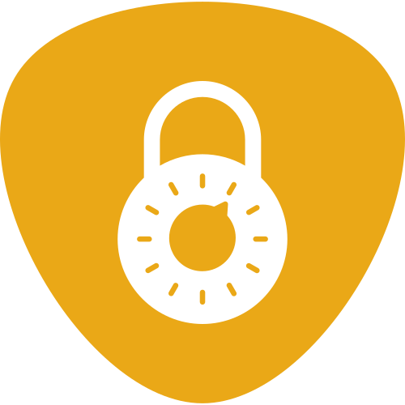
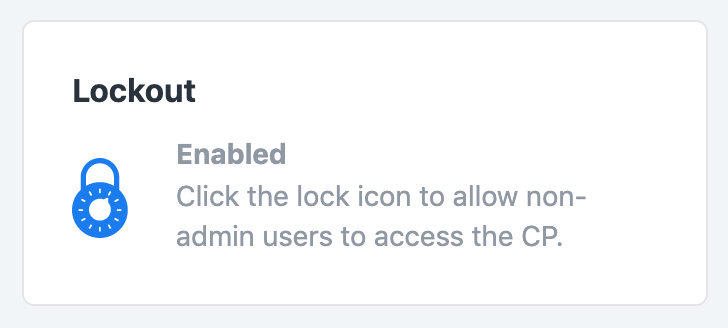

<h1>Lockout</h1>

_Temporarily lock certain users out of the control panel._

## Installation

### Requirements

This plugin requires Craft CMS 5.0.0 or later.

### Plugin Store

Log into your control panel and click on 'Plugin Store'. Search for 'Lockout'.

### Composer

1. Open your terminal and go to your Craft project:

```bash
cd /path/to/project
```

2. Then tell Composer to load the plugin:

```bash
composer require jalendport/craft-lockout
```

3. In the Control Panel, go to Settings → Plugins and click the “Install” button for Lockout.

## Using Lockout

When Lockout is enabled, any non-admin users will be effectively blocked from accessing the CP. Useful if you ever need to make some structural changes and want to prevent new content from being added to the production DB during that time.

### Settings

To enable Lockout, simply toggle the lightswitch. It's that simple!

There is also a message setting where you can pass a custom message to the error screen your users will see when they are locked out.

### Widget



In cases where you're using [Project Config](https://docs.craftcms.com/v3/project-config.html) and `allowAdminChanges` is set to `false` you won't be able to enable/disable Lockout via the plugin settings. Instead you'll want to add the Lockout widget to your CP dashboard - it provides the same functionality as the lightswitch on the plugin settings page.

### CLI

Lockout also provides two console commands for use in your deployment scripts:

```
./craft lockout/lockout/enable      // Restrict non-admin users from accessing the CP.

./craft lockout/lockout/disable     // Allow non-admin users to access the CP.
```

## Found a Bug? Need Support?

Please open an [issue](https://github.com/jalendport/craft-lockout/issues) describing what's going wrong.

## Roadmap

Some things to do, and ideas for potential features:

* Provide the ability to customize which users are locked out or whitelisted.

If there's a feature you think should be added to Lockout, please open an [issue](https://github.com/jalendport/craft-lockout/issues). PRs are also welcome!

* * *

### Contributors

 - Plugin development: [Jalen Davenport](jalendport.com) / @jalendport
 - Icon: [Kiran Joseph](https://thenounproject.com/term/lock/680647/) from the [Noun Project](https://thenounproject.com)
